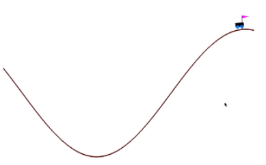
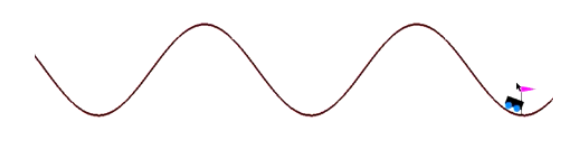

# Cliff Climber using Q-Learning

## Introduction

Q-Learning is a Machine Learning technique that attempts to find the optimal action at each step by initializing random values for each action. Each action is assigned a corresponding reward and the technique attempts to achieve the maximum possible reward and remembers the sequence of events that preceded the action which provides maximum reward. These are stored in a Q-Table.

The cliff climbing problem is commonly applied because it requires a reinforcement learning agent to learn position and velocity, two continuous variables. In this approach, two continuous state variables are converted to discrete states by storing each continuous variable as multiple discrete states. This approach is further improved by tuning the output values of one state to evaluate another state.

The report for the project can be found [here](https://github.com/kmushty/Cliff_Climber/blob/main/Cliff%20Climber%20with%20Q-Learning.pdf)

### Output

